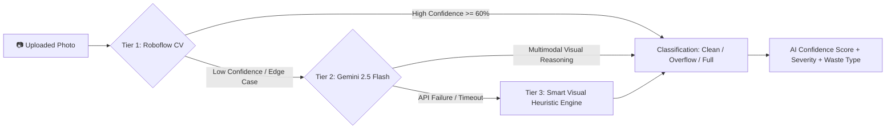
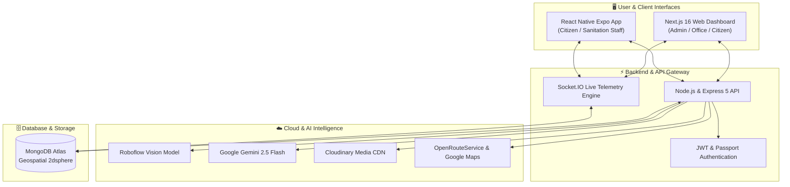

# 🧹 SafaiMitra – Smart AI-Powered Municipal Waste Management Platform

<div align="center">

[](https://www.safaimitra.online/)
[](https://nextjs.org/)
[](https://react.dev/)
[](https://expressjs.com/)
[](https://www.mongodb.com/)
[](https://expo.dev/)
[](https://openrouter.ai/)

<br />

**Transforming Urban Sanitation with Real-Time Telemetry, Computer Vision AI, and Transparent Citizen Engagement.**

[🌐 Explore Live Application](https://www.safaimitra.online/) • [📖 System Architecture](#-system-architecture) • [✨ Key Features](#-key-features) • [🧠 AI Vision Engine](#-multi-tier-ai-vision-engine) • [🚀 Getting Started](#-getting-started)

---

</div>

## 📌 Executive Summary

**SafaiMitra** is an enterprise-grade, end-to-end **Smart City Municipal Solid Waste Management & Telemetry System**. Designed to eliminate ghost reporting, delayed sanitation response, and non-transparent waste collection, SafaiMitra seamlessly connects **Citizens, Sanitation Drivers, Ward Municipal Offices, and Central Administrators** onto a single synchronized platform.

Powered by **Real-Time GPS Tracking, Socket.IO WebSockets, and Multi-Tier Computer Vision AI (Roboflow + Google Gemini 2.5 Flash)**, SafaiMitra delivers verifiable proof of cleaning, proactive dustbin overflow detection, and automated collection routing.

---

## 🌐 Live Production Deployment

| Service | Environment | URL |
| :--- | :--- | :--- |
| **Official Web Portal** | Production | [https://www.safaimitra.online/](https://www.safaimitra.online/) |
| **Citizen App & Dashboard** | Production | [https://www.safaimitra.online/citizen](https://www.safaimitra.online/citizen) |
| **Municipal Office Command** | Production | [https://www.safaimitra.online/office](https://www.safaimitra.online/office) |
| **Central Admin Headquarters** | Production | [https://www.safaimitra.online/admin](https://www.safaimitra.online/admin) |
| **API Gateway** | Cloud Engine | `https://api.safaimitra.online` |

---

## 🎯 The Core Problem & Our Solution

```
┌──────────────────────────────────────────────┐       ┌──────────────────────────────────────────────┐
│        Traditional Waste Management          │       │           The SafaiMitra Solution            │
├──────────────────────────────────────────────┤       ├──────────────────────────────────────────────┤
│ ❌ Untracked dustbins & delayed collections  │  ───> │ ✅ Real-time geospatial dustbin telemetry    │
│ ❌ Manual, unverifiable cleaner attendance   │  ───> │ ✅ AI-verified before & after image audits   │
│ ❌ Citizen grievances lost in paperwork      │  ───> │ ✅ Instant geotagged reporting & live updates│
│ ❌ No fleet route visibility for city admin  │  ───> │ ✅ Live vehicle GPS tracking & smart routing │
└──────────────────────────────────────────────┘       └──────────────────────────────────────────────┘
```

---

## ✨ Key Features & User Roles

### 👤 1. Citizen Portal & Mobile Experience
* **One-Tap Geotagged Reporting**: Capture photo evidence with automatic GPS coordinate tagging.
* **Instant AI Image Screening**: Immediate visual validation of garbage severity upon submission.
* **Live Grievance Lifecycle**: Track complaints in real-time from `Reported` ➔ `Assigned` ➔ `In Progress` ➔ `Resolved`.
* **Proof of Resolution**: View timestamps and verified after-cleaning photos uploaded by sanitation crews.

### 🚛 2. Sanitation Staff & Fleet App
* **Optimized Pickup Routes**: Turn-by-turn navigation across assigned municipal dustbins via OpenRouteService & Maps.
* **Digital Cleaning Validation**: Upload cleaning proof directly analyzed by the AI engine to confirm area sanitization.
* **Live GPS Telemetry**: Real-time vehicle location broadcasting to the command center via WebSocket pipelines.
* **Duty & Shift Management**: Clear visibility into daily assigned tasks, vehicles, and ward boundaries.

### 🏢 3. Municipal Ward / Office Command Center
* **Live GIS Fleet Dashboard**: Interactive Leaflet / Google Maps displaying active vehicles, routes, and dustbin capacities.
* **Automated & Manual Task Dispatch**: Assign open citizen grievances and regular pickups to the nearest available driver.
* **Asset & Inventory Control**: Manage municipal staff, trucks, routes, and public dustbin installations.
* **Ward-Level SLA Monitoring**: Detect bottlenecks, delayed pickups, and unresolved citizen complaints instantly.

### 🛡️ 4. Super Admin Headquarters
* **City-Wide Analytics & Heatmaps**: High-level telemetry on waste collection efficiency, resolution times, and hot spots.
* **Multi-Ward Administration**: Provision municipal ward offices and grant role-based access permissions.
* **Anti-Fraud & AI Audit Logs**: Comprehensive verification history to prevent fraudulent completion logs.

---

## 🧠 Multi-Tier AI Vision Engine

SafaiMitra features an intelligent, multi-tier Computer Vision verification pipeline that validates every photo uploaded by citizens and sanitation workers.



1. **Tier 1 — Roboflow Custom Model (`dustbin-status/5`)**:
   - Ultra-fast edge classification detecting `Clean`, `Overflowing`, `Full`, or `Empty` dustbins with bounding box detection.
2. **Tier 2 — Google Gemini 2.5 Flash Multimodal Vision**:
   - Deep contextual analysis assessing exact waste composition (plastic, organic, debris), hazard levels, and verifying genuine municipal waste images.
3. **Tier 3 — Telemetry & Heuristic Fallback**:
   - Resilient backup pipeline guaranteeing 100% system availability even during external API downtime.

---

## 🏗️ System Architecture



---

## 🗂️ Data Model & ERD

```
Admin (Super User)
  │
  └── manages ──► Office (Ward Command)
                    │
                    ├── employs ──► Staff (Drivers & Supervisors) ── drives ──► Vehicle
                    ├── defines ──► Route ── contains ──► Dustbins (Geospatial Point)
                    └── receives ─► Citizen Complaints
                                       │
                                       ├── linked to ──► Dustbin & Route
                                       ├── evidence  ──► Cloudinary Images
                                       └── audit     ──► AI Vision Validation
```

---

## 🛠️ Technology Stack

| Domain | Technologies |
| :--- | :--- |
| **Web Dashboard** | [Next.js 16](https://nextjs.org/) (App Router), [React 19](https://react.dev/), [TailwindCSS 4](https://tailwindcss.com/), [Lucide React](https://lucide.dev/), [Leaflet](https://leafletjs.com/) / [React-Leaflet](https://react-leaflet.js.org/) |
| **Mobile Application** | [React Native](https://reactnative.dev/), [Expo 54](https://expo.dev/), [NativeWind](https://www.nativewind.dev/), [React Native Maps](https://github.com/react-native-maps/react-native-maps), Expo Camera & Location |
| **Backend & Services** | [Node.js](https://nodejs.org/), [Express.js 5](https://expressjs.com/), [Socket.IO 4](https://socket.io/), [Mongoose 9](https://mongoosejs.com/), [Passport.js](http://www.passportjs.org/), [JWT](https://jwt.io/) |
| **Database** | [MongoDB Atlas](https://www.mongodb.com/atlas) with 2dsphere Geospatial Indexing & Aggregations |
| **AI & Computer Vision** | [Roboflow Computer Vision](https://roboflow.com/), [Google Gemini 2.5 Flash](https://openrouter.ai/) (Multimodal Vision API) |
| **Cloud & Media** | [Cloudinary](https://cloudinary.com/) (Secure Asset CDN & Image Transforms) |
| **GIS & Routing** | OpenRouteService (ORS API), Google Maps Geocoding & Direction APIs |

---

## 🚀 Getting Started (Local Development)

### Prerequisites
- **Node.js**: `v18.x` or `v20.x+`
- **npm** or **yarn** / **pnpm**
- **MongoDB**: Local instance or MongoDB Atlas URI
- **Expo CLI**: `npm install -g expo-cli` (for mobile development)

---

### 1. Clone the Repository
```bash
git clone https://github.com/sumitkumar7766/safaimitra.git
cd safaimitra
```

---

### 2. Backend Setup
```bash
cd backend
npm install
```

Create a `.env` file in the `backend/` directory:
```env
PORT=5002
MONGODB_URI=mongodb+srv://<username>:<password>@cluster.mongodb.net/safaimitra?retryWrites=true&w=majority
JWT_SECRET=your_super_jwt_secret_key
SECRET_KEY=your_session_secret_key

# Cloudinary
CLOUDINARY_CLOUD_NAME=your_cloud_name
CLOUDINARY_API_KEY=your_cloudinary_key
CLOUDINARY_API_SECRET=your_cloudinary_secret

# AI Vision Engines
ROBOFLOW_API_KEY=your_roboflow_key
ROBOFLOW_MODEL_URL=https://classify.roboflow.com/dustbin-status/5
OPENROUTER_API_KEY=your_gemini_openrouter_key
```

Run the backend development server:
```bash
npm run dev
# Server running on http://localhost:5002
```

---

### 3. Web Dashboard Setup
```bash
cd ../web-dashboard
npm install
```

Create a `.env.local` file in the `web-dashboard/` directory:
```env
NEXT_PUBLIC_API_URL=http://localhost:5002
NEXT_PUBLIC_ORS_API_KEY=your_openrouteservice_api_key
```

Start the Next.js development server:
```bash
npm run dev
# Dashboard accessible at http://localhost:3000
```

---

### 4. Mobile App Setup (Expo)
```bash
cd ../mobile-app/safaimitra-app
npm install
npx expo start
```
* Scan the QR code using the **Expo Go** app on Android or iOS, or press `a` for Android Emulator / `i` for iOS Simulator.

---

## 📡 API Overview & Core Endpoints

| Method | Endpoint | Description | Access |
| :--- | :--- | :--- | :--- |
| `POST` | `/api/login/citizen` | Citizen authentication & token issue | Public |
| `POST` | `/api/login/staff` | Sanitation staff login | Public |
| `POST` | `/api/login/office` | Municipal ward office portal login | Public |
| `POST` | `/api/login/admin` | Super Admin authentication | Public |
| `GET` | `/api/citizen/complaints` | Fetch citizen complaints history | Citizen |
| `POST` | `/api/complaint/report` | Register new complaint with photo & GPS | Citizen |
| `POST` | `/api/predict/analyze` | Run dual AI vision analysis on image | Authenticated |
| `GET` | `/api/dustbin/all` | Fetch all dustbins & capacities | Office / Admin |
| `POST` | `/api/dustbin/clean` | Sanitation staff dustbin clean upload | Staff |
| `GET` | `/api/vehicle/live` | Stream real-time vehicle GPS coordinates | All Roles |

---

## 🔒 Security & Privacy

- **Role-Based Access Control (RBAC)**: Strict segregation between Citizen, Staff, Office, and Admin capabilities.
- **JWT Cryptographic Signatures**: Stateless, secure token validation across HTTP and WebSocket channels.
- **Secure Image Uploads**: Cloudinary direct-to-cloud signed streams with file-type validation.
- **Data Integrity**: MongoDB schema validation and sanitization against injection attacks.

---

## 💡 Future Roadmap

- [ ] **IoT Sensor Integration**: Ultrasonic fill-level sensors mounted inside physical dustbins with LoRaWAN telemetry.
- [ ] **Automated Dynamic Dispatch**: Real-time heuristic route re-optimization when emergency overflows are reported.
- [ ] **Citizen Rewards Program**: Green credits and municipal tax incentives for active waste reporting.
- [ ] **Offline-First Staff Sync**: SQLite cache allowing sanitation workers to log cleanups in zero-connectivity areas.

---

## 📄 License & Attribution

This project was built for the **CodeWars Hackathon**.  
Licensed under the [ISC License](LICENSE).

<div align="center">

**Made with ❤️ for cleaner, smarter, and more sustainable cities.**

[🌐 safaimitra.online](https://www.safaimitra.online/) • [⭐ Star on GitHub](https://github.com/sumitkumar7766/safaimitra)

</div>
